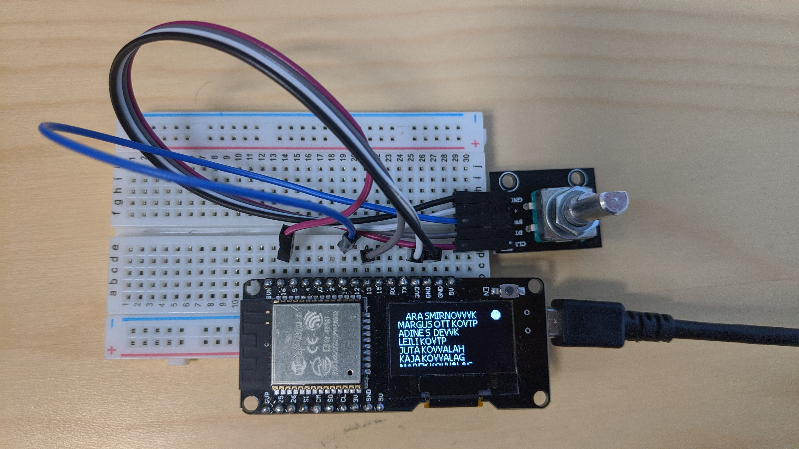

#  README

## Introduction

This directory contains source code for the basic-setup of an ESP32 based personal voting machine. The basic-setup consists of a microcontroller board with ESP32 module, monochrome display and a rotary encoder. The voting client is built to be compatible with the implementation of the IVXV protocol, which is used by the Estonian i-voting system. The proof-of-concept implementation only support Estonian mobile-ID for authenticating the voter and for digitally signing the ballot. ID-card support is not implemented for the proof-of-concept device.


## Installation

In this project, ESP-IDF framework is used with Eclipse C/C++ IDE. Check official documentations to set up the environment.  

1. Download ESP-IDF framework and toolchain  
	- [Get Started](https://docs.espressif.com/projects/esp-idf/en/latest/get-started/index.html)  

2. Download this branch and move to desired folder  
3. Configure Eclipse  
	- [Build and Flash with Eclipse IDE](https://docs.espressif.com/projects/esp-idf/en/latest/get-started-legacy/eclipse-setup.html)  


## Configuration:

At the end, your voting should look like this:
<center></center>

Before flashing application to board memory, you have to connect rotary encoder and update project configuration. You can either use sample configuration file or generate your own. There are two sample configuration files for two different boards in this repository - `sdkconfig_wemos_lolin32` and `sdkconfig_heltec_wifi_kit32`. Choose according to your board model and rename it to `sdkconfig`. In `sdkconfig_wemos_lolin32`, the rotary encoder is wired to GPIO pins 13,14 and 16.

**DT** : Pin 13    
**CLK** : Pin 16   
**SW** : Pin 14   
**+** : 3V3    
**GND** : Ground   

If you have Heltec Wifi Kit 32, pin 16 is reserved for OLED display as RESET pin and cannot be reused. Therefore, in `sdkconfig_heltec_wifi_kit32` the rotary encoder is wired to GPIO pins 18,19 and 17 respectively.

**DT** : Pin 18   
**CLK** : Pin 19   
**SW** : Pin 17  
**+** : 3V3    
**GND** : Ground   


If you're going to generate your own configuration file, type this terminal command 

```console
	foo@bar:~/OpenVotingClient/client/ make menuconfig
```
and follow these steps:  
	- go to `Arduino Configuration`, uncheck `Autostart Arduino setup and loop on boot `, check `Include only specific Arduino libraries` and uncheck all subitems.  
	- go to `Serial flasher config`, check `Compressed upload`, set `Flash SPI speed` 40MHz, `Flash size` 4MB, `'make monitor' baud rate`  115200bps  
	- go to `Partition Table`, select option *Custom partition table CSV* for `Partition Table`, then set `Custom partition table CSV` as *partitions.csv*  
	- go to `Compiler Options`, check `Enable C++ expceptions`
	- go to `Component Config`, 
		- select `Bluetooth`, check `Bluetooth` and then choose `Bluetooth Controller`, set `Bluetooth controller mode (BR/EDR/BLE/DUALMODE)` *BLE Only*
		- select `ESP32-specific`, set `CPU frequency` 240MHz, set `Main XTAL frequency` 40MHz for Wemos Lolin32 or 26MHz for Heltec Wifi Kit32
		- select `FreeRTOS`, uncheck `Run FreeRTOS only on first core`, set `FreeRTOS timer task stack size` 8192
		- select `mbedTLS`, check `Enable hardware MPI (bignum) acceleration` and `Enable hardware SHA acceleration`
	- exit and save
	
Now, you can configure application related data. Again, type `make menuconfig` in terminal, and select `Open Voting Machine`. Here, set your personal ID code, mobil-ID registered phone number,  Wi-Fi name and password, IVXV server details. Also, fill display and rotate encoder related fields based on your board. For Wemos Lolin32, OLED pins are 5,4 and -1 (SDA, SCL, RST). For Heltec Wifi Kit32, they are 4,15 and 16 respectively.

### Display screen (OLED)
Wemos Liolin32 board has an integrated 128x64  SSD1306 OLED screen. U8G2 library is used to manage communications over I2C peripheral. 
``ScreenModule`` class wraps library implementation. Based on your display driver choose corresponding setup function and use it in ```init()``` method:

	esp_err_t ScreenModule::init(){
	...
		u8g2_Setup_ssd1306_i2c_128x64_noname_f(    // ssd1306 128x64 oled display constructor over i2c
		&u8g2,
		U8G2_R0,
		//u8x8_byte_sw_i2c,
		u8g2_esp32_i2c_byte_cb,
		u8g2_esp32_gpio_and_delay_cb);  // init u8g2 structure
	...
	}


### Server connection and Certificates
IVXV voting server address has to be changed prior to election. During elections server address and encryption certifcate is publicly shared. By default, port number is chosed to be 443 (SSL over TLS). Note that, client application doesn't use HTTPS protocol. Rather, it directly communicates with server over TLS.  

By default, microcontrollers come with empty public certificate chain, i.e, there is no certificate to verify tls connections. Therefore, in order to support tls connections to the voting server, server root certificate (`server_root_cert.pem`) is required. Similarly, encryption public key (`server_public_key.pem`) is required for ElGamal encryption. These two files are embedded in flash as specified in `component.mk` :
     
     COMPONENT_EMBED_TXTFILES := server_root_cert.pem  server_public_key.pem 
    
If you use other files, do not forget to change names above and below:


	extern const uint8_t server_root_cert_pem_start[] asm("_binary_server_root_cert_pem_start");
	extern const uint8_t server_root_cert_pem_end[]   asm("_binary_server_root_cert_pem_end");
	
	extern const uint8_t server_public_key_pem_start[] asm("_binary_server_public_key_pem_start");
	extern const uint8_t server_public_key_pem_end[]   asm("_binary_server_public_key_pem_end");
	
	
	...
	RPC::Instance().cfg->cacert_pem_buf  = server_root_cert_pem_start,
	RPC::Instance().cfg->cacert_pem_bytes = server_root_cert_pem_end - server_root_cert_pem_start;


## Build & Run

Either use build target in Eclipse or use terminal commands to build and flash application to ESP32 module.

```console
	make flash -j4 
```

To print logs in terminal:

```console
	make monitor 
```
## Usage

The application follows IVXV protocol as defined in its Documentation Manual. First, you should authorize using mobile-ID, (PIN will be displayed on screen), then see the list of candidates. Use rotary encoder to go up or down on screen and choose one candidate. Push (Click) once the rotary encoder to proceed. It will take around half a second to encrypt your electronic ballot. You'll be asked to confirm the PIN again, but this time to digitally sign your ballot using mobile-ID. Upon successful voting, bluetooth will be turned on to transfer verification request parameters (session id, randomness used in encryption and vote id).

Open modified Android verification application and scan for nearby bluetooth devices. Select `ESP_Board` and follow pairing steps. You'll be asked to enter confirmation PIN which is going to be printed on display. Once verification data is transmitted, bluetooth channel will be turned off. 
