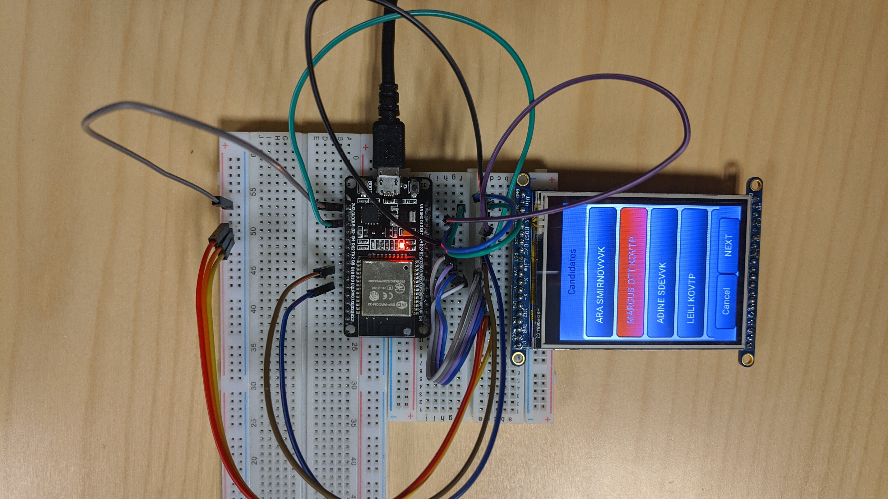

#  README

## Introduction

This directory contains source code for the extended-setup of an ESP32 based personal voting machine. The basic-setup consists of a microcontroller board with ESP32 module and 240x320 ILI9341 TFT LCD with Touchscreen Breakout board. The voting client is built to be compatible with the implementation of the IVXV protocol, which is used by the Estonian i-voting system. The proof-of-concept implementation only support Estonian mobile-ID for authenticating the voter and for digitally signing the ballot. ID-card support is not implemented for the proof-of-concept device.


## Installation

In this project, ESP-IDF framework is used with Eclipse C/C++ IDE. Check official documentations to set up the environment.  

1. Download ESP-IDF framework and toolchain  
	- [Get Started](https://docs.espressif.com/projects/esp-idf/en/latest/get-started/index.html)  

2. Download this branch and move to desired folder  
3. Configure Eclipse  
	- [Build and Flash with Eclipse IDE](https://docs.espressif.com/projects/esp-idf/en/latest/get-started-legacy/eclipse-setup.html)  


## Configuration:

At the end, your voting should look like this:
<center></center>

Before flashing application to board memory, you have to connect screen device and update project configuration. You can either use the sample configuration file or generate your own. Sample configuration file  - `sdkconfig`  is generated for the following configuration schema for DOIT ESP32-DevKit v1 micrcontroller unit:

**CLK**: 14  
**MOSI**: 13  
**CS**: 15  
**D\C**: 21  
**Lite**: 5  
**RST**: 16  
  
**Y+**: 32 (A4)    
**Y-**: 25  
**X+**: 26  
**X-**: 33 (A5)  


If you're going to generate your own configuration file, type this terminal command 

```console
	foo@bar:~/OpenVotingClient/client/ make menuconfig
```
and follow these steps:  
	- go to `Arduino Configuration`, uncheck `Autostart Arduino setup and loop on boot `, check `Include only specific Arduino libraries` and uncheck all subitems.  
	- go to `Serial flasher config`, check `Compressed upload`, set `Flash SPI speed` 40MHz, `Flash size` 4MB, `'make monitor' baud rate`  115200bps  
	- go to `Partition Table`, select option *Custom partition table CSV* for `Partition Table`, then set `Custom partition table CSV` as *partitions.csv*  
	- go to `Compiler Options`, check `Enable C++ expceptions`
	- go to `Component Config`, 
		- select `Bluetooth`, make sure `Bluetooth` is unchecked
		- select `ESP32-specific`, set `CPU frequency` 240MHz, set `Main XTAL frequency` 40MHz
		- select `FreeRTOS`, uncheck `Run FreeRTOS only on first core`, set `FreeRTOS timer task stack size` 8192
		- select `mbedTLS`, check `Enable hardware MPI (bignum) acceleration` and `Enable hardware SHA acceleration`
	- exit and save
	
Now, you can configure application related data. Again, type `make menuconfig` in terminal, and select `Open Voting Machine`. Here, set your personal ID code, mobile-ID registered phone number,  Wi-Fi name and password, IVXV server details. Also, don't forget to change display related fields if it is different than sample configuration.

### Screen and UI

This set-up uses Littlev Graphics Library (LittlevGL) to create UI components and provide user interactivity. ILI9341 screen device is ported to LittlevGL as main screen element. It is possible to replace with any other screen. LittlevGL documentation explains how to use any screen as display element. Connecting screen to microcontroller board should be configured seperately via SPI or I2C bus. All major vendors provide datasheet in which display driver commands and power on sequence is given. In `client/components/drv`, there is a template `disp_spi.h` for SPI connection. `ili9341.c` shows how to use SPI connection and control ILI9341 display driver. Once display is succesfully turned on, it can be ported to LittlevGL using two callbacks. LittlevGL wants to know how to update screen contents. That's why `ili9341_flush` method is defined. More detailed explanation is given here: [Display interface](https://docs.littlevgl.com/en/html/porting/display.html)
Read the documentation and implement flush mechanism for custom display driver. Then, modify `client/main/impl/modules/ScreenModule.cpp` file to point correct function for `disp_drv`

### User Input

Similar to porting screen device, LittlevGL allows to port several types of input interfaces to add interactivity. Currently, 4 input device types are supported and one of them is Pointer (touchpad or mouse). Official documentation about each type is given here: [Input device interface](https://docs.littlevgl.com/en/html/porting/indev.html). Following the same path as in the case of porting display driver, first input device has to be connected and there must be successful connection between device and the board. We used Touchscreen Breakout board that comes with Adafruit ILI9341 display. There are 4 pins to wire: (Y+,X-,Y-,X+). First two of them must be connected to analog pins only. Adafruit provides free open-source [touchscreen library](https://github.com/adafruit/Adafruit_TouchScreen/) using those 4 pins. `client/main/impl/TouchModule.cpp` implements LittlevGL API to port touchscreen interface as an input device.

Screen calibration is required when touchscreen doesn't work accurately. To do so, find the coordinates of 4 points close screen edges and then change values of *TS_MINX, TS_MAXX, TS_MINY, TS_MAXY*.


### Server connection and Certificates
IVXV voting server address has to be changed prior to election. During elections server address and encryption certifcate is publicly shared. By default, port number is chosed to be 443 (SSL over TLS). Note that, client application doesn't use HTTPS protocol. Rather, it directly communicates with server over TLS.  

By default, microcontrollers come with empty public certificate chain, i.e, there is no certificate to verify tls connections. Therefore, in order to support tls connections to the voting server, server root certificate (`server_root_cert.pem`) is required. Similarly, encryption public key (`server_public_key.pem`) is required for ElGamal encryption. These two files are embedded in flash as specified in `component.mk` :
     
     COMPONENT_EMBED_TXTFILES := server_root_cert.pem  server_public_key.pem 
    
If you use other files, do not forget to change names above and below:


	extern const uint8_t server_root_cert_pem_start[] asm("_binary_server_root_cert_pem_start");
	extern const uint8_t server_root_cert_pem_end[]   asm("_binary_server_root_cert_pem_end");
	
	extern const uint8_t server_public_key_pem_start[] asm("_binary_server_public_key_pem_start");
	extern const uint8_t server_public_key_pem_end[]   asm("_binary_server_public_key_pem_end");
	
	
	...
	RPC::Instance().cfg->cacert_pem_buf  = server_root_cert_pem_start,
	RPC::Instance().cfg->cacert_pem_bytes = server_root_cert_pem_end - server_root_cert_pem_start;


## Build & Run

Either use build target in Eclipse or use terminal commands to build and flash application to ESP32 module.

```console
	make flash -j4 
```

To print logs in terminal:

```console
	make monitor 
```
## Usage

The application follows IVXV protocol as defined in its Documentation Manual. First, you should authorize using mobile-ID, (challenge code will be displayed on screen), then see the list of candidates. Use your finger or stylus to go up or down on screen and choose one candidate. Click on _NEXT_ button  to proceed. It will take around half a second to encrypt your electronic ballot. You'll be asked to confirm challenge code again, but this time to digitally sign your ballot using mobile-ID. Upon successful voting, vote verification parameters (session id, randomness used in encryption and vote id) will be converted to QR code. Open Android verification application and scan this QR code to verify your vote. After you're done, click _FINISH_ button to hide QR code.
